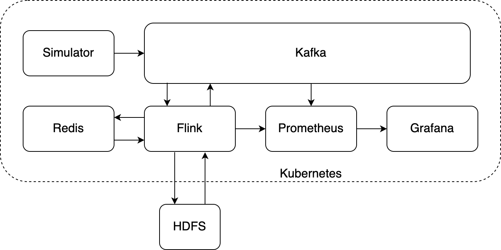

# MP-DS
Master Project Distributed System.

## Infrastructrue



### Create a Kubernetes cluster on Google Cloud

The following commands assume that a project has been created in GCP and ``gcloud`` has been configured for use.

Deploy a 3 node Kubernetes cluster with the e2-standard-4 machine-type with:
```
gcloud container clusters create mpds-cluster --num-nodes=3  \
  --image-type "UBUNTU" --no-enable-basic-auth  --no-enable-autoupgrade \
  --cluster-version "1.16.15-gke.4300" --machine-type e2-standard-4
```

After the Kubernetes cluster has been created, configure kubectl with:
```
gcloud container clusters get-credentials mpds-cluster
```

To access the Kubernetes cluster from a browser, open up the firewall with:
```
gcloud compute firewall-rules create nodeports \
  --allow tcp --source-ranges=0.0.0.0/0
```

Create a hadoop cluster in your region for HDFS with:
```
gcloud dataproc clusters create hadoop --region=europe-west3
```

### Deploy infrastructure with Helm charts
Kafka, Flink, Redis, Prometheus, and Grafana can be deployed on a Kubernetes cluster using the [Helm](https://helm.sh) charts located in the ``helm-charts`` directory. Configure which charts to deploy in the global values.yaml by setting ``enabled: true`` for each desired technology. Cluster sizes and ports for external access can also be specified here.

Each subchart can be deployed by itself and contains its own values.yaml file with futher configurations. If deployed from the umbrella chart, values in the global values.yaml will overwrite the values in the subchart's values.yaml.

Deploy the charts with:
```
helm install [DEPLOYMENT NAME] [CHART DIRECTORY]
```

Uninstall the charts with:
```
helm uninstall [DEPLOYMENT NAME]
```

### Viewing metrics in Grafana

Grafana is accessible at <kubernetes_node_ip>:<nodeport>.
The default nodeport is ``30080`` and the default username and password is ``admin``

After logging into Grafana, the data source must be added.
Navigate to: ``Configuration > Data Sources > Add data source > Prometheus``
Set the Url to ``prometheus:9090`` and click save and test. You should see a green notification that the data source is working.

To import the premade grafana dashboard to show metrics, navigate to:
``Create > Import > Upload JSON file``
Upload the ``grafana-dashboard.json`` file from the root directory.
